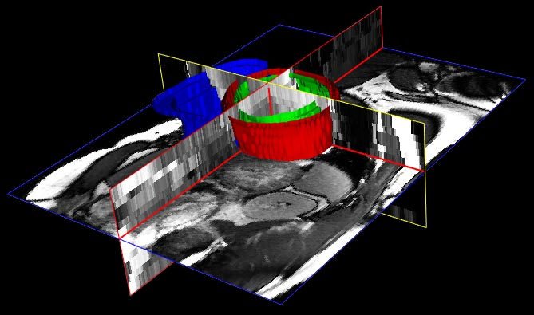
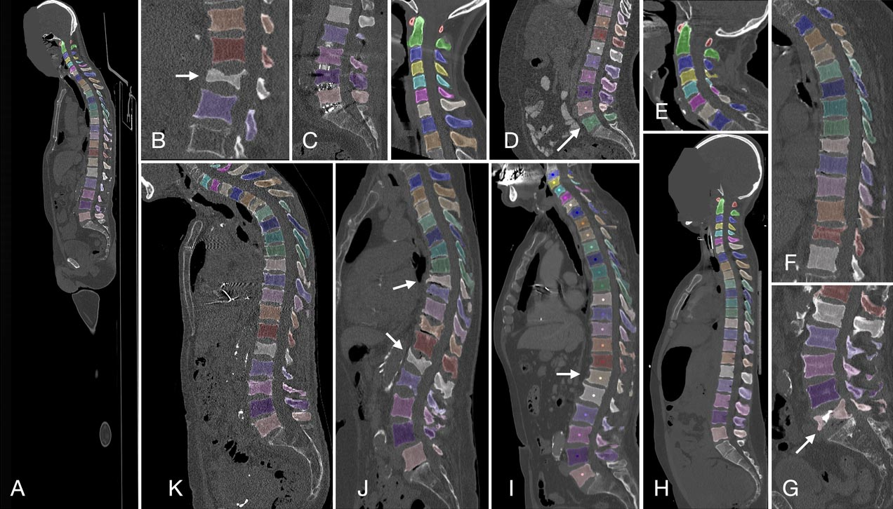
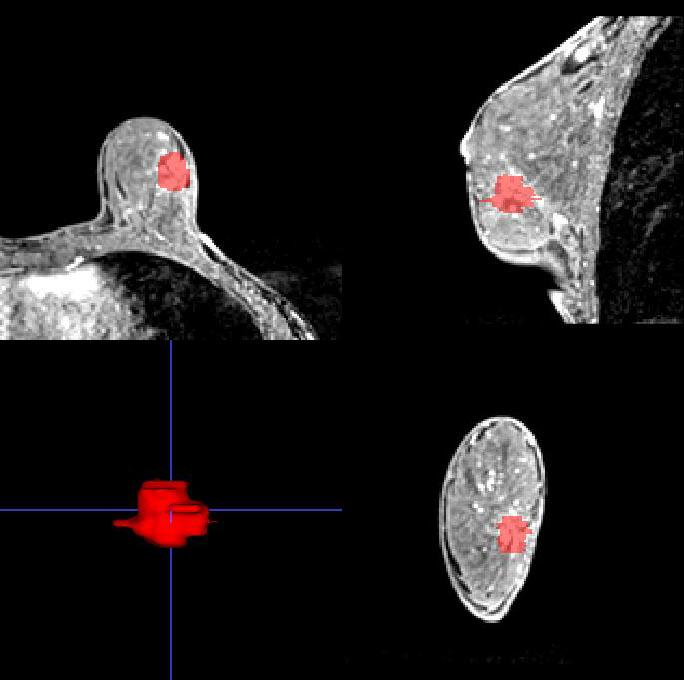
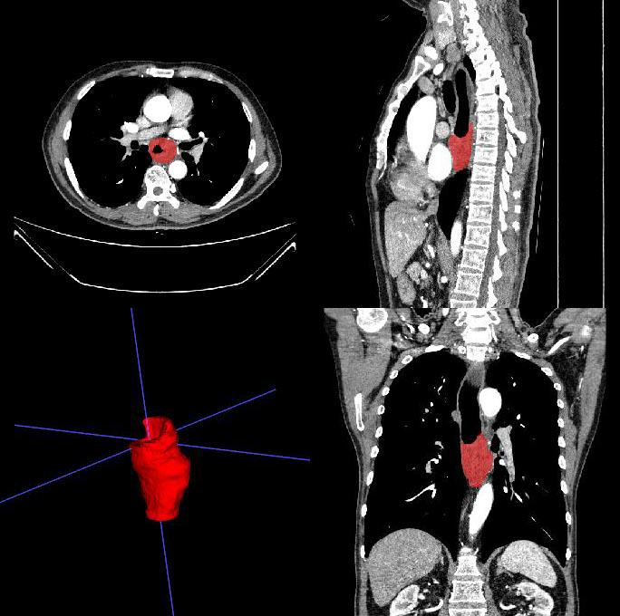

# Med3D Data Archive Wrapping Code Base

The core motivation of this project is to standardize the unstructured and heterogeneous directory/file structures of diverse medical data archives. Additionally, it integrates basic image preprocessing and cleansing procedures (including hole filling and small region suppression) to improve data quality, thereby facilitating convenient and efficient downstream biomedical research and application development.

This repository contains wrapping pipelines for 3D medical image data archives. The code base is developed and provided by an individual researcher - currently a Ph.D student from **Center for Biomedical Imaging and Bioinformatics (CBIB)**, Huazhong University and Technology (HUST).

## Currently Supported Data Archives

✅[Public] ACDC

✅[Public] AMOS22 (AMOS-CT & AMOS-MRI)

✅[Public] VerSe (VerSe19 & VerSe20)

✅[Public] Duke-Breast-FGT-Segmentation (Self Preprocessed Version 2025.4.10)

✅[Private] Breast Non Mass Enhancement Segmentation (NME-Seg-2025.8.25)

✅[Private] Esophagus Cancer Analysis (ESO-2025.10.31)

<div align="left">
   
</div>

<div align="left">
     
</div>


## Wrapped Data Archives Overview

Detailed script usage instructions for each data archive are provided in their respective corresponding directories (please refer to the <u>links</u> in the first column of the table below).

If you only intend to use the pre-wrapped versions of the data archives (i.e., the already standardized and cleansed data), please refer to the [Downloads](#Wrapped Data Archives Downloads) section.

| Data Archive                                                 | Object                  | Task                         | Samples | Volume Type       |
| ------------------------------------------------------------ | ----------------------- | ---------------------------- | ------- | ----------------- |
| [ACDC](ACDC/ACDC_data_preprocess.md)                         | Heart Anatomy           | Segmentation, Classification | 300     | 4D Cine-MRI Frame |
| [AMOS22](AMOS22/AMOS22_data_preprocess.md)                   | Abdomen Organ           | Segmentation                 | 360     | CT & MRI          |
| [VerSe](VerSe/VerSe_data_preprocess.md)                      | Vertebra                | Segmentation                 | 374     | CT                |
| [Duke-Breast-FGT-Segmentation-2025.4.10](Duke-Breast-FGT-Segmentation-2025.4.10/Duke-Breast-FGT-Segmentation_data_preprocess.md) | Breast Anatomy          | Segmentation                 | 100     | MRI-T1CE          |
| [NME-Seg-2025.8.25](NME-Seg-2025.8.25/NME-Seg-2025.8.25_data_preprocess.md) | Breast NME Lesion       | Segmentation                 | 1316    | MRI-DCE           |
| [ESO-2025.10.31](ESO-2025.10.31/ESO-2025.10.31_data_preprocess.md) | Esophagus Cancer Lesion | Segmentation, Classification | 548     | CT & CECT         |

## Wrapped Data Archives Downloads

| Data Archive                           | Source  | Downloads                                                    | Official Sites                                               |
| -------------------------------------- | ------- | ------------------------------------------------------------ | ------------------------------------------------------------ |
| ACDC                                   | Public  | [[Baidu Drive](https://pan.baidu.com/s/1YklrSzE9W2FKbd65wzgOXQ?pwd=7jm3)] | https://www.creatis.insa-lyon.fr/Challenge/acdc/databases.html<br />https://humanheart-project.creatis.insa-lyon.fr/database/#collection/637218c173e9f0047faa00fb |
| AMOS22                                 | Public  | [[Baidu Drive](https://pan.baidu.com/s/1owJdUTH5--NhuHHEI2QhMg?pwd=qu5p)] | https://amos22.grand-challenge.org<br />https://era-ai-biomed.github.io/amos/dataset.html<br />https://dataset.sribd.cn/amos.html<br />https://zenodo.org/records/7262581 |
| VerSe                                  | Public  | [[Baidu Drive](https://pan.baidu.com/s/18AORpIDLnTYMI1VHOn6vxw?pwd=r6qa)] | https://github.com/anjany/verse.git                          |
| Duke-Breast-FGT-Segmentation-2025.4.10 | Public  | [[Baidu Drive](https://pan.baidu.com/s/1Xx_6o4KzTK61zRUo2KAA4Q?pwd=vugf)] | https://doi.org/10.7937/TCIA.e3sv-re93                       |
| NME-Seg-2025.8.25                      | Private | [[Baidu Drive](https://pan.baidu.com/s/1ZRMRcmym64zsGWPsJ1fitw)] (password required) | Not Publicly Available (Contact d202481651@hust.edu.cn)      |
| ESO-2025.10.31                         | Private | [[Baidu Drive](https://pan.baidu.com/s/12vgxqKR-QhsBbdMN-6WooA)] (password required) | Not Publicly Available (Contact d202481651@hust.edu.cn)      |

## Environment Configuration

This project has been validated on **Python 3.10.19**. We recommend creating a dedicated Python environment (please specify `{ENV_MAIN}`) for this project, and using Python package managers such as `conda` or `mamba` for environment and package management (`mamba` is preferred for faster installation speeds).

### Step 1: Create a Python Environment

```sh
conda create -n {ENV_MAIN} python==3.10.19
```

### Step 2: Activate the Environment

```sh
conda activate {ENV_MAIN}
```

### Step 3: Install Core Dependencies

This project has been tested on a platform equipped with **CUDA 12.9**.

Install PyTorch first (note the CUDA version constraint):

```sh
conda install 'cuda-version>=12.2,<=12.9' 'pytorch=*=*cuda*' -c conda-forge
```

Install MONAI 1.5.1:

```sh
conda install monai==1.5.1 -c conda-forge
```

Install Scikit-related packages:

```sh
conda install scikit-image scikit-learn
```

Install other auxiliary tool packages:

```sh
conda install nibabel simpleitk pandas pyyaml openpyxl tqdm matplotlib 
```

### [Optional] Using PyRadiomics Feature Extractor and GPU-Accelerated K-Means

✅Required by [ESO-2025.10.31/pCR_analysis](ESO-2025.10.31/pCR_analysis/ESO-2025.10.31_pCR_analysis_process.md)

PyRadiomics (for radiomics feature extraction) supports a maximum Python version of 3.9, whereas RAPIDS 25.12 (for GPU-accelerated K-Means clustering) requires Python ≥ 3.10 for compatibility. Due to this version conflict, **two separate dedicated Python environments** must be created to run these two modules independently.

The PyRadiomics workflow in this project is validated on **Python 3.9.20**, and the RAPIDS 25.12 workflow is validated on **Python 3.10.19**.

#### Python Environment for PyRadiomics

Create Python environment `ENV_RADIOMICS`.

```sh
conda create -n {ENV_RADIOMICS} python==3.9.20
```

```sh
conda activate {ENV_RADIOMICS}
```

Install the foundational dependencies (MONAI, PyTorch, and auxiliary tools):

```sh
conda install monai==1.4.0 'cuda-version>=12.2,<=12.9' 'pytorch=*=*cuda*' -c conda-forge
conda install scikit-image scikit-learn nibabel simpleitk pandas pyyaml openpyxl tqdm matplotlib
```

Then, install PyRadiomics 3.1.0a2 (the validated version):

```sh
conda install pyradiomics==3.1.0a2 -c radiomics
```

#### Python Environment for RAPIDS (GPU-Accelerated K-Means)

If GPU acceleration for K-Means is not required, the scikit-learn implementation (`sklearn.cluster.KMeans`) included in the main project environment (`{ENV_MAIN}`) is sufficient for all relevant workflows (CPU-only execution). Note that the RAPIDS library only needs to be installed if you intend to use GPU-accelerated K-Means; this installation step may be omitted entirely for CPU-based runs.

Create Python environment `ENV_RAPIDS`.

```sh
conda create -n {ENV_RAPIDS} python==3.10.19
```

```sh
conda activate {ENV_RAPIDS}
```

Install RAPIDS 25.12:

```sh
conda install rapids=25.12 'cuda-version>=12.2,<=12.9' -c rapidsai -c conda-forge
```

Install other dependencies (MONAI and auxiliary tools):

```sh
conda install monai==1.5.1 -c conda-forge
conda install scikit-image scikit-learn nibabel simpleitk pandas pyyaml openpyxl tqdm matplotlib
```

##### [Alternative] Use Main Project Environment for RAPIDS

RAPIDS 25.12 is compatible with the project's main environment (`{ENV_MAIN}`). If you prefer not to create a separate `{ENV_RAPIDS}`, install RAPIDS 25.12 directly into `{ENV_MAIN}` with the following commands:

```sh
conda activate {ENV_MAIN}
conda install rapids=25.12 'cuda-version>=12.2,<=12.9' -c rapidsai -c conda-forge
```

